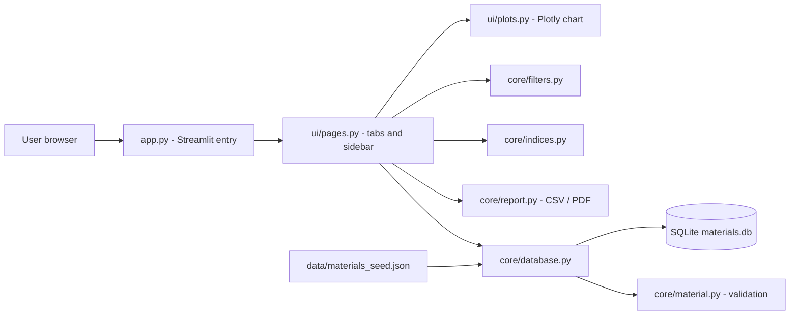

# Architecture

## Layers

**Rule:** `core/` never imports Streamlit. The same logic can therefore be tested without a browser, reused in a script or notebook, or put behind an API later.

## Key classes and functions
| Component | Responsibility |
|---|---|
| `Material` (frozen dataclass) | One validated material; rejects negative, zero, non-finite or implausible values; derives density in Mg/m³ and cost per volume. |
| `MaterialDatabase` | Schema creation, CRUD, seeding, history log. Parameterised SQL only; `CHECK` constraints repeat the validation inside the database. |
| `Constraints` + `apply_constraints` | Validated, inclusive min/max filters and class selection. |
| `PerformanceIndex` | One Ashby index: numerator property, exponent p, denominator property; computes values and the log-log guide-line slope 1/p. |
| `rank_materials`, `guide_line` | Pure functions on pandas data; ranking and guide-line geometry. |
| `report.py` | CSV bytes and a two-page PDF built with matplotlib. |

## Maths
For M = Yᵖ / X (Y = E or σy, X = ρ or cost per volume): along a line of constant M, y = M^(1/p) · x^(1/p), so the line has slope 1/p on log-log axes. `guide_line` draws it through the best material: y = y₀ · (x / x₀)^(1/p). Tests verify that M is constant along the generated line.

## Units (Ashby convention)
density Mg/m³ · modulus GPa · strength MPa · cost USD/kg · cost per volume USD/L (= cost × density in kg/L). The database stores density in kg/m³ (SI); conversion happens once in `Material.to_record()`.

## Error handling
Custom exceptions (`ValidationError`, `DuplicateMaterialError`, `MaterialNotFoundError`, `DatabaseError`) are raised in `core/` and turned into friendly messages in the UI. Invalid sidebar input never crashes the app; impossible filters show a warning and a grey chart.

## Testing strategy
166 tests: unit tests per module, boundary-value tests (lower and upper limits, just-outside values, NaN, infinity, wrong types, negative, min > max, empty results, single material, empty database), data-integrity tests on the seed file, and end-to-end UI tests with Streamlit `AppTest`.

## Why Streamlit only (no FastAPI)
One client, one runtime. An API layer would add a second service, network calls and CORS configuration with no benefit for this scope.
